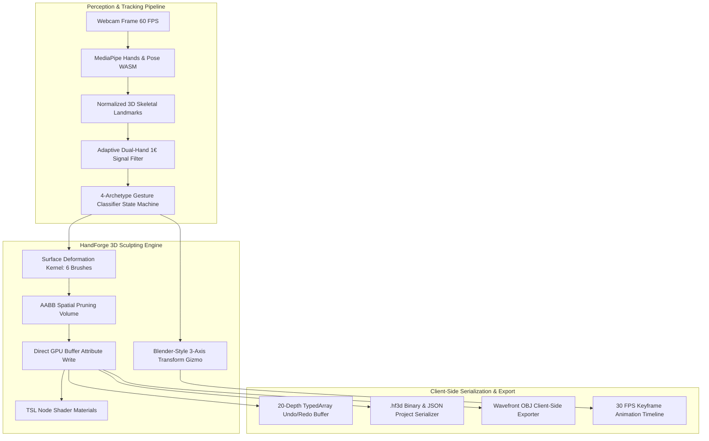

# HandForge

**Browser-Native Spatial 3D Digital Sculpting & Animation Studio with GPU-Accelerated Vertex Deformation**

[](LICENSE)
[](https://nextjs.org/)
[](https://threejs.org/)
[](https://www.typescriptlang.org/)
[](https://developers.google.com/mediapipe)

---

## Overview

HandForge is a browser-native, gesture-controlled 3D digital sculpting and animation studio. It couples WebGPU-accelerated vertex displacement pipelines with Google MediaPipe WebAssembly (WASM) skeletal tracking, enabling touchless surface sculpting across 66,000+ vertex meshes directly inside the browser's 60 FPS main execution loop without specialized hardware or cloud rendering servers.

The application translates dual-hand skeletal knuckle coordinates into real-time sculpting actions—Push, Pull, Inflate, Smooth, Flatten, and Crease brushes—with adaptive One Euro Filter coordinate smoothing, Blender-style transform gizmos, keyframe animation timelines, and custom `.hf3d` project serialization.

---

## Architectural Dataflow



---

## Core Capabilities

### 1. Real-Time Surface Deformation Engine (6 Brushes)
- **Brush Archetypes**: Push, Pull, Inflate, Smooth (Laplacian averaging), Flatten (plane projection), and Crease.
- **AABB Spatial Pruning**: Intersects the sculpting cursor sphere with local Axis-Aligned Bounding Boxes to avoid iterating over non-affected vertices.
- **Quadratic Falloff**: Calculates per-vertex displacement deltas using $(1 - (d / r)^2)^2$ smoothing curves.
- **Direct GPU Buffer Writes**: Injects offset vectors directly into `sculptOffset` Float32 buffer attributes at sub-frame latency.

### 2. Dual-Hand Gesture Classification State Machine
Evaluates normalized fingertip-to-wrist distance ratios, thumb-index pinch metrics, and joint curl signatures with temporal hysteresis debouncing:
- **Pinch-Sculpt (Hand 1)**: Thumb-index distance $< 0.065$. Deforms active mesh vertices along surface normals.
- **Open-Palm-Smooth (Hand 1)**: Flat palm extension (all fingers open). Executes Laplacian smoothing pass.
- **Fist-Orbit (Hand 2)**: Full fist curl ($> 80\%$). Rotates camera or active mesh across dominant spatial planes.
- **Victory-Scale (Hand 2)**: Dual-finger V-sign or thumb-index pinch. Resizes mesh boundaries dynamically.
- **Thumbs-Up Trigger**: Undo last sculpting stroke.
- **Three-Finger Spread**: Cycles through available sculpting brushes.

### 3. Adaptive Dual-Hand One Euro Filter
- Suppresses webcam landmark coordinate tremor while maintaining sub-frame sculpting responsiveness.
- Dynamically adjusts cutoff frequency based on instantaneous fingertip velocity magnitude across independent X, Y, and Z axes for both hands simultaneously.

### 4. Blender-Style Transform Gizmo System
- Renders three orthogonal torus rotation rings (X, Y, Z axes) and 12 spatial grab nodes.
- Highlights dominant rotation axes during gesture-driven orbit interactions by evaluating displacement vector magnitudes across independent 3D planes.

### 5. Multi-Material TSL Node Shader Pipeline
- Pre-configured materials: **Digital Clay**, **Sculptor Gold**, **Cyber Neon**, and **Obsidian**.
- Injects custom `sculptOffset` vertex attribute displacement nodes into the position graph of each `MeshStandardNodeMaterial`, enabling non-destructive material switching without reallocating vertex deformation buffers.

### 6. Keyframe Animation Timeline Engine
- Supports record, playback, seek, and scrubber interactions at 30 FPS.
- Computes linear interpolation (`lerp` / `slerp`) of mesh position, rotation, and scale between sorted keyframes for smooth motion previews.

### 7. Custom `.hf3d` Project Serialization & Client-Side Wavefront OBJ Export
- **`.hf3d` Format**: Encodes full sculpting session state—Float32Array vertex offsets, mesh shape and material identifiers, transforms, brush parameters, and keyframes—with magic header validation.
- **Wavefront OBJ**: Formats deformed vertex positions and face topology into plaintext payloads and triggers blob downloads with automatic `URL.revokeObjectURL` memory cleanup.

---

## Technical Specifications

| Parameter | Specification |
| :--- | :--- |
| **Mesh Density** | 66,000+ vertices (Standard Sphere), 32,000+ vertices (Torus / Cylinder / Box) |
| **Render Target** | 60 FPS sustained on consumer GPUs via Three.js WebGPU / WebGL |
| **Gesture Latency** | &lt; 16.6 ms per frame (synchronous with animation loop) |
| **Undo Buffer Depth** | 20 snapshots with memory-efficient `Float32Array.slice()` clones |
| **Camera Tracking** | MediaPipe Hands & Pose WebAssembly (WASM) running on client CPU/GPU |

---

## Getting Started

### Prerequisites
- Node.js 18.x, 20.x, or later
- Modern browser with WebGL 2.0 / WebGPU and WebRTC support (Chrome, Edge, Brave, Firefox, Safari)
- Standard USB or integrated webcam

### Installation
```bash
# Clone the repository
git clone https://github.com/code-dibyajyotirout/handforge.git
cd handforge

# Install dependencies
npm install

# Run the development server
npm run dev
```

Open `http://localhost:3000` in your web browser.

---

## License

This project is licensed under the terms of the [GNU Affero General Public License v3.0](LICENSE).
